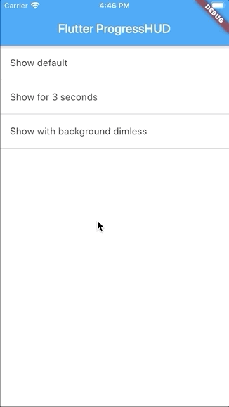

# FlutterProgressHUD

ProgressHUD for Flutter.



## Getting Started

### Add dependency

```yaml
dependencies:
  flutter_progress_hud: 0.1.0
```

### Examples

```dart
var progressHud = FlutterProgressHud(
  context,
  cancelable: true,                  // Cancelable when pressing Android back key
  canceledOnTouchOutside: true,      // Cancelable when touch outside of the ProgressHud
  dimBackground: false,              // Dimming background when ProgressHud is showing
  hudColor: Color(0x99000000),       // Color of the ProgressHud
  indicatorColor: Color(0xFFFFFFFF), // Color of the spinning progress indicator
);
/// Show ProgressHud
progressHud.show();
/// Dismiss ProgressHud
progressHud.dismiss();
```

